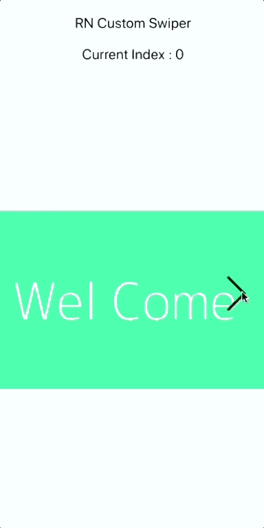

### React Native custom swiper using Flatlist

### Use images or custom views for swiping, lets follow below steps to use this library.

# Guide

# Installation
```
npm i react-native-custom-swiper
```

# Usage
```
import Swiper from "react-native-custom-swiper";

<Swiper
    style={{ flex: 1 }}
    currentSelectIndex={0}
    swipeData={this.state.imgArray}
    renderSwipeItem={this.renderImageSwipeItem}
    onScreenChange={this.screenChange}
/>

```


# Example:
### Write below code inside App.js File.

```
constructor(props) {
    super(props);
    this.state = {
        imgArray: [
            "https://dummyimage.com/600x400/00ffae/ffffff.png&text=Wel+Come",
            "https://dummyimage.com/600x400/00ffae/ffffff.png&text=React+Native",
            "https://dummyimage.com/600x400/00ffae/ffffff.png&text=Custom+Swiper",
        ],
        currentIndex: 0,
    };
}

// Handled swipe position change
screenChange = index => {
    console.log("index when change :=> \n", index);
    this.setState({ currentIndex: index });
};

// Render Rows
renderImageSwipeItem = item => {
    return (
        <View>
            <Image style={{ height: height, width: width }} source={{ uri: item }} resizeMode="contain" />
        </View>
    );
};


render() {
    return (
        <SafeAreaView style={styles.container}>
            <Text style={styles.txtStyle}> RN Custom Swiper </Text>
            <Text style={styles.txtStyle}> Current Index : {this.state.currentIndex} </Text>
            <Swiper
                style={{ flex: 1 }}
                currentSelectIndex={0}
                swipeData={this.state.imgArray}
                renderSwipeItem={this.renderImageSwipeItem}
                onScreenChange={this.screenChange}
            />
        </SafeAreaView>
    );
}

```
### You can see output Below

# Results:



### Properties

#### Basic

| Prop  | Default  | Type | Description |
| :------------ |:---------------:| :---------------:| :-----|
| swipeData | [] | `array` | Array of data which user want to show in swiper |
| renderSwipeItem | ()=>{} | `function` | Create element of swiper |
| currentSelectIndex | 0 | `number` | Index of initial screen. |
| showSwipeBtn | true | `bool` | For hide or show left/right button |
| style | Default style | `object` | Change swiper style |
| onScreenChange | (index) => {} | `func` | Function call when screen changed |
| leftButtonImage | Default left Arrow source {required("leftArrowString")} | `string` | Modify left arrow image |
| rightButtonImage | Default right Arrow source {required("rightArrowString")} | `string` | Modify right arrow image |
| containerWidth | Screen width | `number` | Customise swiper screen width |


